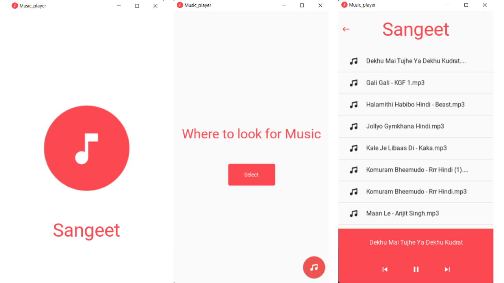

# Sangeet Music Player

Sangeet is an android app made with python using the Kivy *(python framework for developing mobile apps and other multitouch application software*) and kivyMD (*KivyMD is a collection of Material Design compliant widgets for use with Kivy*)

